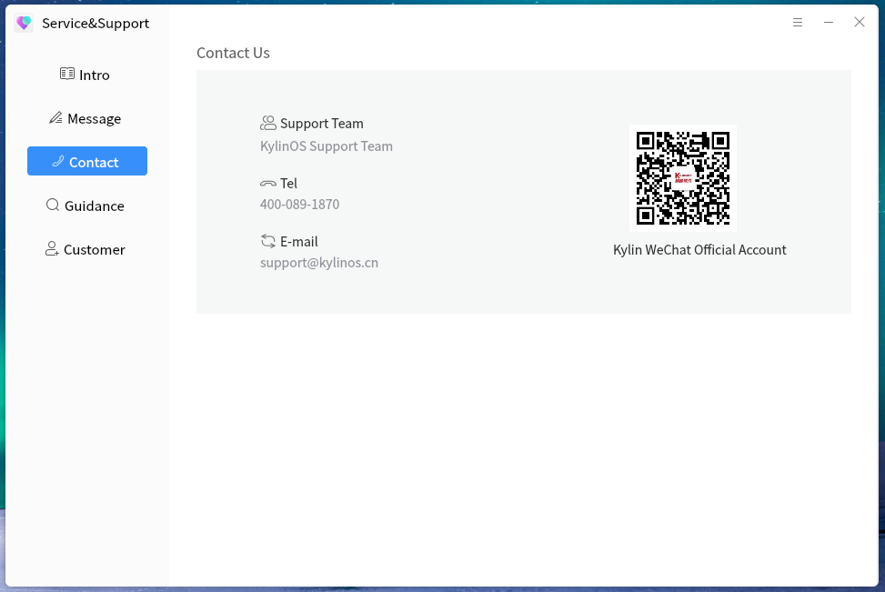

# Kylin Support
## Overview
Kylin Support tool is ukui desktop integration tool, which provides users with artificial feedback services and help documents. Users can feed back technical questions online through manual customer service, or seek the answer through online message.

 

## Introduction

 

Open the default home page of the software, and the software introduction page is shown in the figure below.

 

 

The message consultation page is shown in the figure below.

 

 

The contact us page is shown below.

 

 

The self service support page is shown in the figure below.

 

 

The online customer service page is shown in the figure below.

 

 

### Feature Introduction
You can click the button in the navigation bar on the left to switch to different pages.

 

## Leave Meassage

 

This page provides customers with a message feedback function to help customers feed back help information to Kylin Support team through text description, pictures, videos and other auxiliary ways.

 

### Feature Introduction

 

Users can select the type of question feedback, fill in the question description, upload the attachment and system log, fill in the contact email, and give feedback

Difficulties encountered to the technical team, the technical team will process the results through email to inform users.

Among them, the consultation category, consultation content and email are required items. You need to select and fill in before you can click the submit button.

The remaining items are optional, adding positioning problems that can help the technical team to locate more conveniently.

 

 

## Online Customer

 

Click the online customer service button in the left guide bar to jump to the online customer service website and communicate with manual customer service in real time.

 
 

 

## Others

 

You can also get technical support through other ways, such as telephone, wechat, email, etc. Or through the official website search information, view the user manual and other ways to solve the problem.

 

 

 

 

