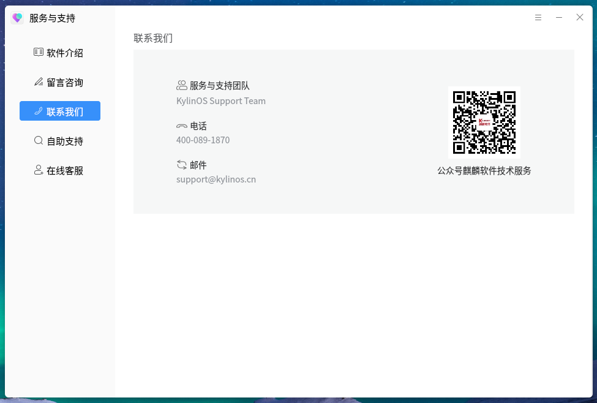

# 麒麟服务与支持
## 概 述
麒麟服务与支持工具为ukui桌面集成工具，为用户提供人工反馈服务及帮助文档等支持。用户可通过人工客服在线反馈技术问题，或通过在线留言方式，寻求结束解答。

 

## 软件介绍页面

 

打开软件后的默认主页，软件介绍页面如下图所示。

 

 

留言咨询页面如下图所示。

 

 

联系我们页面如下图所示。

 

 

自助支持页面如下图所示。

 

 

在线客服页面如下图所示。

 

 

### 功能介绍
    您可以点击左侧引导栏中的按钮选择切换不同页面。

 

## 留言反馈

 

该页面提供给客户一个留言反馈的功能，帮助客户通过文字描述，图片、视频等辅助的方式，将求助信息反馈给麒麟客服团队。

 

### 功能介绍

 

 用户可通过选择问题反馈类型，填写问题描述，上传附件、系统日志，填写联系邮箱的方式，反馈所
 遇到的困难给技术团队，由技术团队将处理结果通过邮件告知用户。
 
 其中，咨询类别，咨询内容及邮箱为必填项，需要选择及填写后才可点击提交按钮。
 
 其余项为可选项，添加可帮助技术团队更加便捷的定位问题。

 

 

## 在线客服

 

点击左侧引导栏的在线客服按钮，可跳转至在线客服网页端，与人工客服实时沟通。

 
 

 

## 其他功能介绍

 

您还可以通过其他方式获取技术支持，如电话、微信、邮件等方式。或通过在官网搜索资料，查看用户手册等方式自主解决问题。

 

 

 

 

